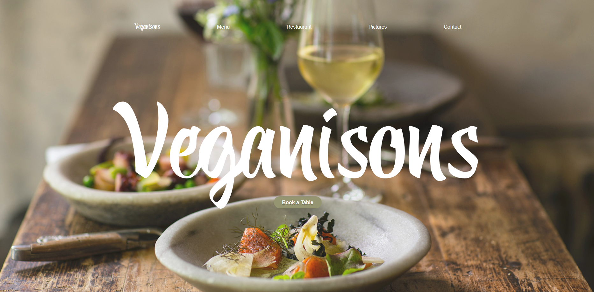

**Projet Bootstrap : Projet Restaurant** 
   ======================================================

   ## Site Web du restaurant

   ### **[Veganisons](https://laura-vln.github.io/restaurant-css-framework/)**

   ## Site Web du restaurant :

  Projet de groupe ayant pour but la création d'un site web pour un restaurant avec Bootstrap.

  Le projet est accessible via ce lien [GitHub page](https://laura-vln.github.io/restaurant-css-framework/)

_Nous sommes un petit restaurant d'origine francaise actuellement installé à Londre et proposant des produits végans, frais, provenant de nos petits producteurs locaux. Veganisons est le carrefour culturel et économique du centre de Londres où se cotoit en toute simplicité, modernité, tradition, simplicité et végan_.

  ### Membres du groupe :
- [**Laura Vilain**](https://github.com/Laura-VLN)
- [**Jérémy Mertens**](https://github.com/JER89)
- [**Loris Conti**](https://github.com/ShinYami)
- [**Michael Zerghe**](https://github.com/Michael-Zerghe)

  ### Le site contient :

  Une page Accueil faite par Loris

  Une page Restaurant faite par Laura

  Une page Menu faite par Jeremy

  Une page Images faite par Michael
  
  Une page contact faite par Loris et Jeremy

  ### Les outils :

    * Bootstrap 
    * HTML
    * CSS

### Lien Externe :

Images provenant de https://unsplash.com/
Font :  Google Font & https://www.1001fonts.com/

### Délais : 

    * Début: le 25janvier 2021
    * Fin : le 29 janvier 2021 

